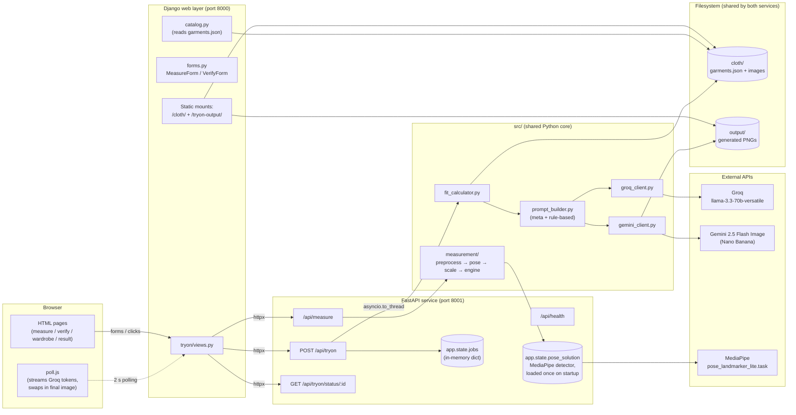
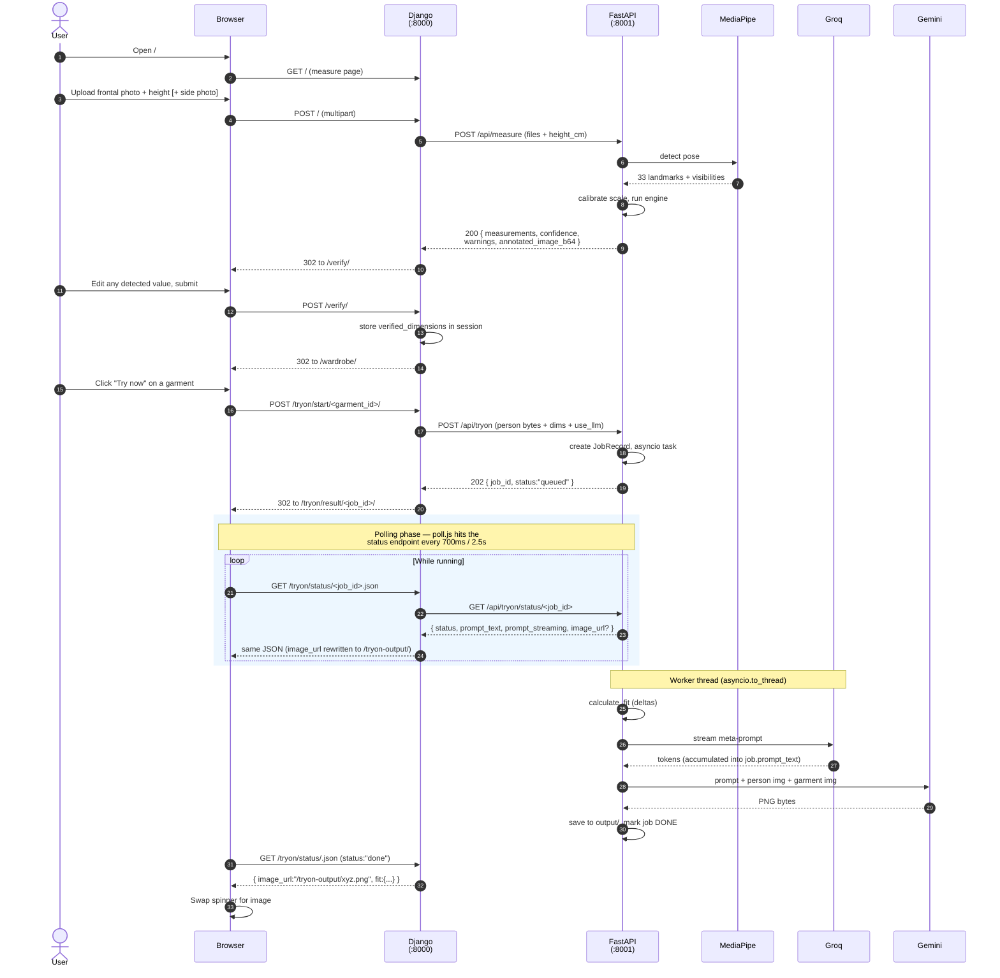
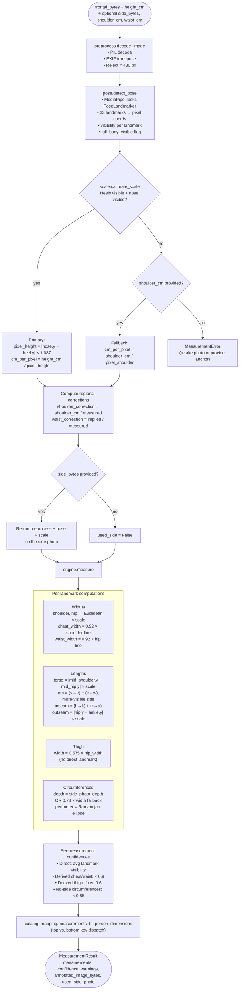
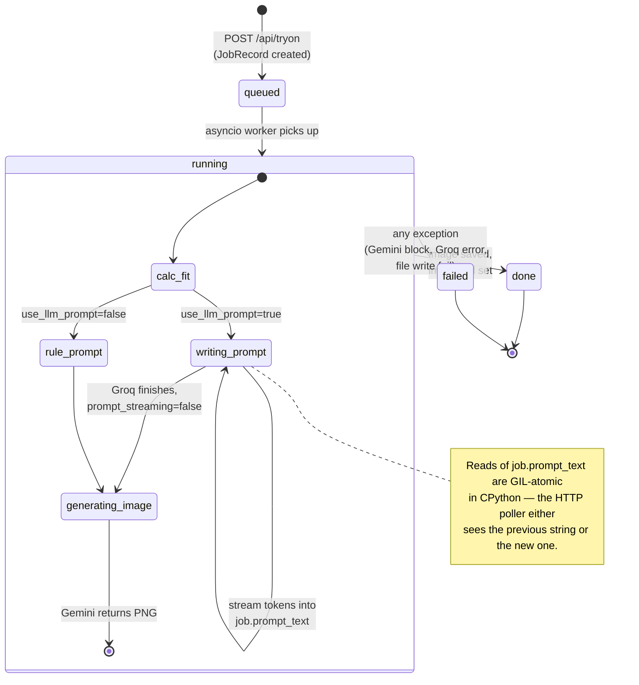
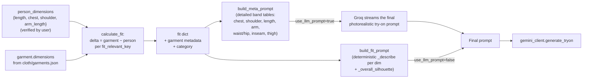

# Fit-Aware Virtual Try-On

A photo-based virtual try-on prototype that goes beyond pixel-pasting: it **measures the wearer**, **computes per-landmark fit deltas against the garment spec**, and **conditions image generation on the actual fit math**. So a size-S top on a size-L body actually renders as taut and strained, not magically the right size.

Two parallel frontends share one Python core:

- **Streamlit** ([`app.py`](app.py)) — single-process demo UI
- **Django + FastAPI** ([`web/`](web/) + [`api/`](api/)) — split-service architecture, the path forward for productization

---

## What it actually does

1. User uploads a frontal full-body photo (optional side photo for circumference accuracy) and enters their height.
2. **MediaPipe Pose Landmarker** detects 33 body landmarks.
3. A pixel→cm scale is calibrated from `|nose.y − heel.y| × 1.087` (the `1.087` adds back the missing nose-to-crown segment without needing segmentation).
4. The measurement engine computes widths (Euclidean), lengths (sum of two segments on the more-visible side), and circumferences (Ramanujan ellipse perimeter from width + depth; depth comes from the side photo or defaults to `0.78 × width`).
5. The user verifies/edits the detected values in a confidence-graded panel.
6. They pick a garment. **`fit_calculator`** computes `delta = garment − person` per landmark.
7. **Groq (Llama 3.3 70B)** writes a detailed photorealistic try-on prompt from a meta-instruction that encodes how each delta magnitude should physically read (snug, tight, strained, drowning in fabric, etc.). A rule-based fallback exists for when Groq is off.
8. **Gemini 2.5 Flash Image** ("Nano Banana") renders the final image conditioned on that prompt + the person photo + the garment reference.

---

## System architecture



The Streamlit app ([`app.py`](app.py)) bypasses the Django/FastAPI split entirely and calls the same `src/` core directly, in-process.

---

## End-to-end user flow (Django + FastAPI path)



---

## Measurement pipeline (`src/measurement/`)



### Landmark → catalog key mapping

| Catalog key | Internal field | Category |
|---|---|---|
| `length` | `torso_length_cm` | top |
| `chest` | `chest_circumference_cm` | top |
| `shoulder` | `shoulder_width_cm` | top |
| `arm_length` | `arm_length_cm` | top |
| `length` | `outseam_cm` | bottom |
| `waist` | `waist_circumference_cm` | bottom |
| `hip` | `hip_circumference_cm` | bottom |
| `inseam` | `inseam_cm` | bottom |
| `outseam` | `outseam_cm` | bottom |
| `thigh` | `thigh_circumference_cm` | bottom |

---

## Try-on job lifecycle



---

## Fit logic



Delta convention: **negative = garment smaller than body** (compression / stretch / exposure); **positive = larger** (drape / excess / bunching). Band thresholds in [`prompt_builder.py`](src/prompt_builder.py) translate each delta magnitude into specific fabric-behavior language so the image model has a concrete physical target.

---

## Tech stack

| Layer | Choice | Why |
|---|---|---|
| Web frontend (productizable) | Django 5 | sessions, forms, admin, templates out of the box |
| API service | FastAPI + uvicorn | async, type-checked, OpenAPI docs free |
| Demo frontend | Streamlit | fast prototype iteration |
| Pose estimation | `mediapipe>=0.10` (Tasks API, `pose_landmarker_lite`) | works offline after first model download, no GPU needed |
| Image generation | Gemini 2.5 Flash Image (`google-genai`) | multimodal (text + 2 images), follows fit instructions |
| Prompt writing | Groq `llama-3.3-70b-versatile` | high tokens/sec, fits the streaming UX |
| Image I/O | Pillow + OpenCV | EXIF transpose + skeleton overlay |
| HTTP client | httpx | Django → FastAPI |
| Storage | filesystem (`cloth/`, `output/`) | prototype only — see roadmap |
| Sessions | SQLite | prototype only — see roadmap |

---

## Project layout

```
Fashion_Image/
├── app.py                          # Streamlit single-process UI
├── src/                            # Shared Python core
│   ├── fit_calculator.py           # delta = garment − person
│   ├── prompt_builder.py           # meta + rule-based prompts
│   ├── groq_client.py              # streaming text generation
│   ├── gemini_client.py            # image generation
│   └── measurement/
│       ├── pipeline.py             # entry point (bytes in → MeasurementResult out)
│       ├── preprocess.py           # PIL decode + EXIF + size guard
│       ├── pose.py                 # MediaPipe Tasks PoseLandmarker
│       ├── scale.py                # pixel → cm calibration
│       ├── engine.py               # widths, lengths, circumferences
│       ├── catalog_mapping.py      # raw measurement → catalog key
│       └── types.py                # dataclasses + MeasurementError
├── api/                            # FastAPI service
│   ├── main.py                     # app + lifespan (loads pose model once)
│   ├── jobs.py                     # JobRecord + async worker
│   ├── deps.py                     # shared FastAPI dependencies
│   ├── schemas.py                  # Pydantic request/response models
│   └── routers/
│       ├── health.py               # GET /api/health
│       ├── measure.py              # POST /api/measure
│       └── tryon.py                # POST /api/tryon + status endpoint
├── web/                            # Django frontend
│   ├── manage.py
│   ├── config/                     # settings, urls, asgi/wsgi
│   └── tryon/                      # the only app
│       ├── views.py                # measure → verify → wardrobe → result
│       ├── forms.py                # MeasureForm + VerifyForm
│       ├── services.py             # httpx wrapper around FastAPI
│       ├── catalog.py              # read-only garments.json access
│       ├── urls.py
│       ├── templates/tryon/
│       └── static/tryon/
├── cloth/                          # Static garment catalog
│   ├── garments.json               # canonical catalog (units: cm)
│   ├── garment_dimensions.xlsx     # source for size charts
│   ├── T-Shirt/ Blouse/ ...        # per-class image folders
│   └── *.jpg                       # legacy G1-G11 garment images
├── output/                         # Generated try-on PNGs
├── tools/
│   ├── classify_garments.py        # Gemini-based clothing classifier
│   ├── collect_garments.py         # batch-collect N per class from raw pool
│   └── build_catalog.py            # write per-class entries into garments.json
├── run.sh / run.bat                # boot both services
├── stop.sh / stop.bat              # kill anything on :8000 and :8001
├── requirements.txt                # Streamlit deps
├── api/requirements.txt
├── web/requirements.txt
└── .env                            # API keys (gitignored)
```

---

## Setup

### 1. Prerequisites

- Python 3.11+
- A Gemini API key ([https://aistudio.google.com/apikey](https://aistudio.google.com/apikey))
- A Groq API key ([https://console.groq.com](https://console.groq.com)) — optional, only needed for LLM-written prompts
- ~200 MB free disk for the MediaPipe model + dependencies

### 2. Install

```bash
python -m venv venv
# Windows
venv\Scripts\pip install -r requirements.txt -r api\requirements.txt -r web\requirements.txt
# macOS / Linux
venv/bin/pip install -r requirements.txt -r api/requirements.txt -r web/requirements.txt
```

### 3. Configure `.env` (project root)

```ini
GEMINI_API_KEY=your_gemini_key_here
GROQ_API_KEY=your_groq_key_here
# Optional — defaults shown
API_BASE_URL=http://127.0.0.1:8001
DJANGO_SECRET_KEY=dev-only-secret-key-change-me-before-prod
DJANGO_DEBUG=1
```

The Gemini client also accepts the lowercase `api_key=...` for historical reasons.

### 4. First-run Django bootstrap

```bash
cd web
python manage.py migrate    # creates db.sqlite3 (sessions only)
```

---

## Running locally

### Option A — Django + FastAPI (productizable path)

```bash
# from project root
./run.sh              # macOS / Linux / Git Bash
run.bat               # Windows cmd / PowerShell
```

This boots:

- FastAPI on `http://127.0.0.1:8001` ([http://127.0.0.1:8001/docs](http://127.0.0.1:8001/docs) for OpenAPI UI)
- Django on `http://127.0.0.1:8000`

Open `http://127.0.0.1:8000/` in a browser.

To stop everything:

```bash
./stop.sh             # or stop.bat on Windows
```

### Option B — Streamlit (demo)

```bash
streamlit run app.py
```

---

## API reference (FastAPI)

| Method | Path | Purpose |
|---|---|---|
| `GET` | `/api/health` | Reports whether the pose model is loaded |
| `POST` | `/api/measure` | Run the measurement pipeline; returns measurements + base64 pose overlay |
| `POST` | `/api/tryon` | Enqueue a try-on job. Returns `202 { job_id, status: "queued" }` |
| `GET` | `/api/tryon/status/{job_id}` | Polled by the browser; returns running state + streaming Groq tokens + final image URL when done |

### `POST /api/measure` (multipart form)

| Field | Type | Required | Notes |
|---|---|---|---|
| `frontal_image` | file | yes | jpg/png/jpeg, ≥ 480 px on each side |
| `height_cm` | float | yes | 100 – 230 |
| `side_image` | file | no | enables real-depth circumferences |
| `shoulder_cm` | float | no | regional correction anchor |
| `waist_cm` | float | no | regional correction anchor |

**Response** ([`MeasureResponse`](api/schemas.py)):

```json
{
  "measurements": {
    "shoulder_width_cm": 41.2,
    "chest_circumference_cm": 95.4,
    "torso_length_cm": 64.1,
    "arm_length_cm": 58.7,
    ...
  },
  "confidence": { "shoulder": 0.97, "chest": 0.88, ... },
  "warnings": ["No side photo provided — circumferences estimated using a fixed depth ratio."],
  "annotated_image_b64": "iVBORw0K...",
  "used_side_photo": false
}
```

### `POST /api/tryon` (multipart form)

| Field | Type | Required | Notes |
|---|---|---|---|
| `person_image` | file | yes | the frontal photo to render onto |
| `garment_id` | str | yes | must exist in `cloth/garments.json` |
| `person_dimensions` | str (JSON) | yes | `{"length": 64, "chest": 95, "shoulder": 41, "arm_length": 58}` |
| `use_llm_prompt` | bool | no (default `true`) | `false` uses the rule-based fallback |

**Response** (`202`):

```json
{ "job_id": "8c41...", "status": "queued" }
```

### `GET /api/tryon/status/{job_id}`

```json
{
  "job_id": "8c41...",
  "status": "running",          // queued | running | done | failed
  "prompt_text": "TASK: render a photorealistic...",
  "prompt_streaming": true,     // Groq still emitting tokens
  "image_url": null,            // populated when status="done"
  "fit": null,                  // populated when status="done"
  "prompt_used": null,
  "error": null
}
```

---

## Catalog schema (`cloth/garments.json`)

```json
{
  "units": "cm",
  "notes": "Dimensions are visual estimates...",
  "garments": [
    {
      "id": "G2",
      "name": "Adidas Navy Striped Bodysuit",
      "type": "Bodysuit",
      "gender": "Women",
      "size": "S",
      "fit_style": "Bodycon",
      "category": "top",
      "fit_relevant_keys": ["length", "chest", "shoulder", "arm_length"],
      "image": "00026_00.jpg",
      "path": "00026_00.jpg",
      "dimensions": {
        "length": 71,
        "chest": 81,
        "shoulder": 36,
        "arm_length": 18
      }
    }
  ]
}
```

- `category` is `"top"` or `"bottom"` and drives which key map the measurement pipeline uses.
- `fit_relevant_keys` lists the dimensions the fit calculator and prompt builder should consider — keys outside this list are ignored even if present in `dimensions`.
- `path` is resolved relative to `cloth/`.

The legacy `G1`–`G11` entries live at the catalog root (`cloth/00014_00.jpg`, etc.). Bulk entries written by [`tools/build_catalog.py`](tools/build_catalog.py) use IDs like `TSH-M-03` and live under `cloth/T-Shirt/`, `cloth/Blouse/`, etc.

---

## Configuration

| Env var | Default | Where read |
|---|---|---|
| `GEMINI_API_KEY` (or `api_key`) | — | [`gemini_client.py`](src/gemini_client.py) |
| `GROQ_API_KEY` | — | [`groq_client.py`](src/groq_client.py) |
| `API_BASE_URL` | `http://127.0.0.1:8001` | [`web/config/settings.py`](web/config/settings.py) |
| `DJANGO_SECRET_KEY` | dev fallback | [`web/config/settings.py`](web/config/settings.py) |
| `DJANGO_DEBUG` | `1` | [`web/config/settings.py`](web/config/settings.py) |
| `DJANGO_ALLOWED_HOSTS` | `*` in DEBUG | [`web/config/settings.py`](web/config/settings.py) |
| `GLOG_minloglevel` | `3` (set by `run.sh`/`run.bat`) | silences MediaPipe telemetry retries |

---

## Known limitations

- **2D-only measurement.** Limb foreshortening from off-axis poses reads as shorter limbs. Subject must face the camera squarely.
- **Baggy clothing inflates widths** because pose landmarks anchor to silhouette joints, not the body underneath.
- **Single frontal photo can't produce true circumference** — fallback is `0.78 × width` ellipse.
- **In-memory job store.** `app.state.jobs` is wiped on FastAPI restart; in-flight jobs are lost. Single-worker only.
- **Photos persist on disk** in `output/` indefinitely. Not GDPR-safe as-is.
- **No authentication / rate limiting.** Anyone with the URL can burn the Gemini quota.
- **MediaPipe Tasks detectors are not thread-safe**; concurrent `/api/measure` calls may race against the shared `app.state.pose_solution`.
- **Streamlit version is dev-only**: long-running session state, not horizontally scalable.

---

## Roadmap

1. **Production hardening** (current focus) — auth, rate limiting, secrets manager, HTTPS, structured logging, Sentry. See `memory/project_productization.md` for the full sequencing.
2. **Persistent job store** — replace `app.state.jobs` with Redis + Celery/RQ; allow >1 worker.
3. **Photo retention TTL + signed URLs** — move `cloth/` and `output/` to S3; signed downloads only; 24h auto-delete on user photos.
4. **Real garment catalog integration** — Shopify/WooCommerce import to replace synthetic + jittered dimensions from `build_catalog.py`.
5. **Size recommender** — surface "size M will fit you best" alongside the rendered image, derived from the same fit deltas.
6. **Quality validator** — CLIP-similarity gate on the output to auto-retry renders where the face changed or the garment was lost.
7. **Calibration learning** — log verify-step edits as labeled data; periodically refit the `0.92` / `0.78` / `1.087` constants per cohort.

---

## License

Prototype, not yet licensed for redistribution. See repository owner.
