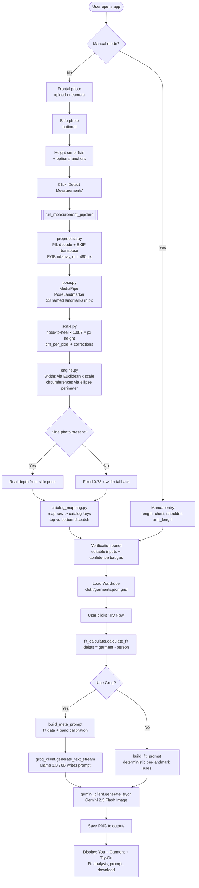
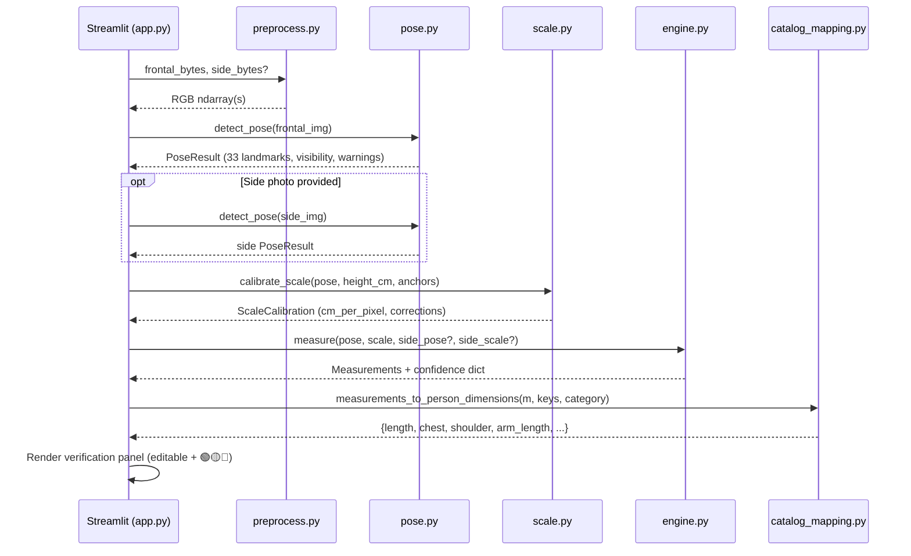
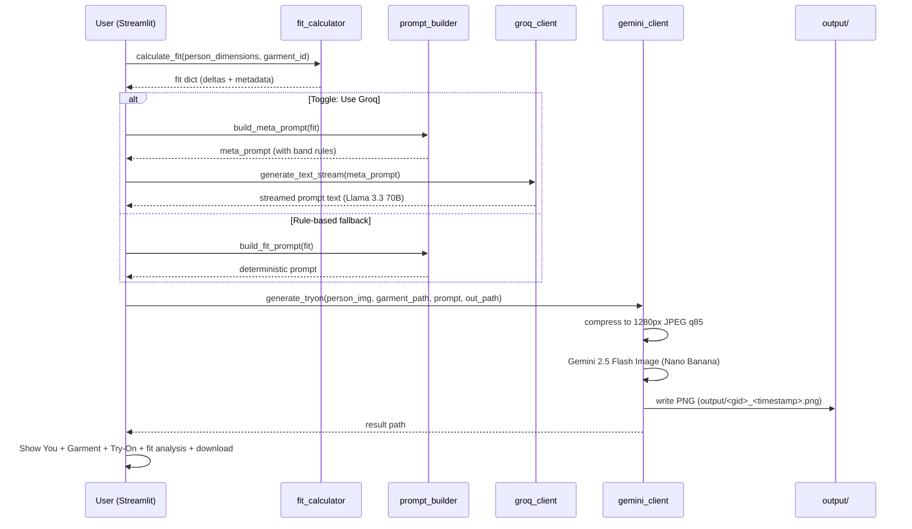

# Fit-Aware Virtual Try-On

A photorealistic virtual try-on system that goes beyond "paste the garment on the photo." It detects the wearer's body measurements from a single photo, compares them to the garment's flat-spec dimensions, writes a fit-aware prompt describing how the fabric must behave on that specific body, and feeds the result to Gemini 2.5 Flash Image ("Nano Banana") for the final render.

The core differentiator is the **fit logic layer**: the system understands that a chest delta of −12 cm on a Bodycon top should render as visible tension lines and side-seam bowing, while the same delta on a Relaxed cut should read as unintentionally body-hugging. Severity scales with the magnitude of the delta, not with a fixed bucket.

---

## What it does

1. **Captures a frontal photo** (and optionally a side photo) of the user.
2. **Detects body landmarks** with MediaPipe Pose Landmarker.
3. **Calibrates pixel→cm scale** using the user's height as an anchor; optional shoulder/waist anchors apply regional corrections.
4. **Computes measurements** — widths from 2D landmark distances, circumferences via Ramanujan's ellipse-perimeter approximation (depth from the side photo when available, fixed `0.78 × width` fallback otherwise).
5. **Lets the user verify and edit** every value with per-measurement confidence badges (🟢 ≥ 0.8 · 🟡 ≥ 0.6 · 🔴 below).
6. **Loads the garment catalog** ([cloth/garments.json](cloth/garments.json)) and renders a wardrobe grid.
7. **Calculates fit deltas** (`garment − person`) for every fit-relevant key.
8. **Writes the try-on prompt** — Groq (Llama 3.3 70B) generates a calibrated, band-aware prompt OR a deterministic rule-based builder produces it offline.
9. **Generates the try-on image** with Gemini 2.5 Flash Image, preserving the wearer's face/pose/background and the garment's prints/seams/cuffs, while physically reflecting the fit deltas.

---

## End-to-end flow



---

## Repository layout

```
Fashion_Image/
├── app.py                          # Streamlit frontend, single entry point
├── requirements.txt
├── .env                            # GEMINI_API_KEY + GROQ_API_KEY (not committed)
│
├── src/
│   ├── fit_calculator.py           # garment - person = deltas
│   ├── prompt_builder.py           # build_meta_prompt + build_fit_prompt (rule fallback)
│   ├── gemini_client.py            # generate_tryon -> PNG on disk
│   ├── groq_client.py              # text-only Llama 3.3 70B for prompt writing
│   │
│   └── measurement/
│       ├── pipeline.py             # run_measurement_pipeline orchestrator
│       ├── preprocess.py           # bytes -> RGB ndarray, EXIF safe
│       ├── pose.py                 # MediaPipe Tasks PoseLandmarker wrapper
│       ├── scale.py                # px -> cm calibration + corrections
│       ├── engine.py               # widths, lengths, ellipse circumferences
│       ├── catalog_mapping.py      # raw measurements -> catalog dimension keys
│       └── types.py                # Landmark, Measurements, ScaleCalibration, etc.
│
├── cloth/                          # garment catalog + product images
│   ├── garments.json               # id, name, fit_style, category, dimensions, ...
│   ├── Blouse/  T-Shirt/  Sweater/  Bodysuit/  Crop Top/  Tank Top/
│   └── *.jpg
│
├── output/                         # generated try-on PNGs (gitignored)
│
└── docs
    ├── Approach.md                         # original IDM-VTON approach memo
    ├── hybrid_body_measurement_approach.md # current measurement design
    ├── README.md                           # this file
    └── SETUP.md                            # install + run instructions
```

---

## How the fit logic works

For each landmark in the garment's `fit_relevant_keys`, the calculator computes `delta = garment_dimension - person_dimension` (units = cm). The sign is the qualitative signal, the magnitude drives the physical render.

| Sign | Meaning | Visual outcome |
| --- | --- | --- |
| `delta < 0` | Garment smaller than body | Compression, stretch, tension lines, exposure (cropped hem, short sleeve) |
| `delta ≈ 0` | True to size | Clean skim fit, no tension, no slack |
| `delta > 0` | Garment larger than body | Drape, vertical folds, bunching, dropped seams |

Calibrated severity bands live in [src/prompt_builder.py:53-124](src/prompt_builder.py#L53-L124). Examples for **chest** (circumference, cm):

| Delta band | What the render must show |
| --- | --- |
| `0 to ±2.5` | True skim fit, fabric just kisses the body |
| `-7.5 to -15` | Clearly tight, faint horizontal tension lines from underarm seams, side seams begin to bow |
| `-15 to -25` | Heavily strained, bodycon-style, prints stretched and distorted |
| `beyond -38` | Fabric at maximum possible stretch — keep plausible, no tearing |
| `+7.5 to +15` | Loose, gentle vertical folds from the shoulder |
| `+15 to +30` | Oversized, deep folds, tent-leaning silhouette |

Equivalent bands exist for shoulder, length, arm/sleeve (top category) and for waist, hip, inseam, outseam, thigh (bottom category). The chosen band set is dispatched by `category` in the garment record.

---

## How the prompt gets written

Two routes, controlled by the sidebar toggle:

### LLM route (default ON)
1. [build_meta_prompt](src/prompt_builder.py#L33) packages the fit data + band rules + style instructions into a meta-prompt.
2. [groq_client.generate_text_stream](src/groq_client.py#L39) streams a 450–600 word, photorealistic image-generation prompt from Llama 3.3 70B.

### Rule-based route (offline fallback)
[build_fit_prompt](src/prompt_builder.py#L166) emits a deterministic prompt assembled from per-landmark `_describe` blocks plus an overall silhouette summary. No API call required.

Either way, the output prompt is the only text input that Gemini sees alongside the person and garment images.

---

## Measurement pipeline detail



Key numerical choices:
- `NOSE_TO_CROWN_FACTOR = 1.087` — compensates the missing nose-to-crown segment when calibrating from nose-to-heel pixels ([src/measurement/scale.py:19](src/measurement/scale.py#L19)).
- `DEPTH_TO_WIDTH_RATIO = 0.78` — fallback when no side photo is supplied ([src/measurement/engine.py:17](src/measurement/engine.py#L17)).
- `THIGH_WIDTH_FACTOR = 0.575` — thigh derived from hip width since MediaPipe has no thigh landmark ([src/measurement/engine.py:18](src/measurement/engine.py#L18)).
- `LANDMARK_VISIBILITY_THRESHOLD = 0.5` — landmarks below this are skipped for the corresponding measurement.
- Circumferences use Ramanujan's 2nd ellipse-perimeter approximation; the side-photo path uses the horizontal pixel distance between same-named landmarks as the depth proxy.

---

## Generation pipeline detail



---

## Garment catalog

[cloth/garments.json](cloth/garments.json) is the source of truth. Each entry:

```json
{
  "id": "G2",
  "name": "Adidas Navy Striped Bodysuit",
  "type": "Bodysuit",
  "size": "S",
  "fit_style": "Bodycon",
  "category": "top",
  "fit_relevant_keys": ["length", "chest", "shoulder", "arm_length"],
  "path": "00026_00.jpg",
  "dimensions": { "length": 71, "chest": 81, "shoulder": 36, "arm_length": 18 }
}
```

- `category` (`top` / `bottom`) selects the band set and the measurement→catalog key mapping.
- `fit_relevant_keys` controls which deltas drive the prompt — adding `inseam` to a pants entry, for example, makes the inseam delta render.
- `dimensions` values are in cm. Chest/waist/hip/thigh are **circumferences**; shoulder is seam-to-seam width; arm_length is shoulder-to-cuff; length is hem distance from the appropriate origin.

The catalog ships with women's tops; the measurement engine already produces lower-body keys (`waist`, `hip`, `inseam`, `outseam`, `thigh`) so adding pants/jeans is a catalog-only change.

---

## External services

| Service | Used for | Env var |
| --- | --- | --- |
| **Gemini 2.5 Flash Image** (`gemini-2.5-flash-image`) | Final try-on image generation | `api_key` or `GEMINI_API_KEY` |
| **Groq** (`llama-3.3-70b-versatile`) | Writing the fit-aware prompt | `GROQ_API_KEY` |
| **MediaPipe Pose Landmarker** (lite model) | On-device body landmark detection | none — model auto-downloads to `~/.cache/mediapipe/` |

Without a Gemini key the wardrobe loads but image generation fails with a clear sidebar warning. Without a Groq key the LLM prompt route fails — flip the sidebar toggle off to use the rule-based fallback.

---

## Limitations and honest caveats

- All measurements are 2D + 2.5D ellipse circumferences — there is **no SMPL or true 3D body model**. Side photos help; they don't make it 3D.
- The catalog dimensions are visual estimates from product photos, not measured spec sheets. Verify against real product specs before drawing fit conclusions.
- MediaPipe lite is fast and on-device but loses landmarks on baggy clothing, partial occlusion, or unusual poses. Visibility thresholds gate each measurement, and the UI surfaces low-confidence values in red.
- Gemini 2.5 Flash Image occasionally refuses prompts that read as extreme strain (described correctly by the band logic). The pipeline raises a clear error rather than silently degrading.

---

## See also

- [SETUP.md](SETUP.md) — environment setup, running locally, troubleshooting.
- [hybrid_body_measurement_approach.md](hybrid_body_measurement_approach.md) — design rationale for the measurement layer.
- [Approach.md](Approach.md) — original (pre-MediaPipe) approach memo for historical context.
