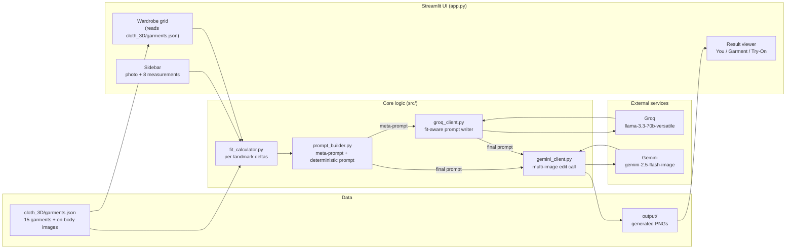
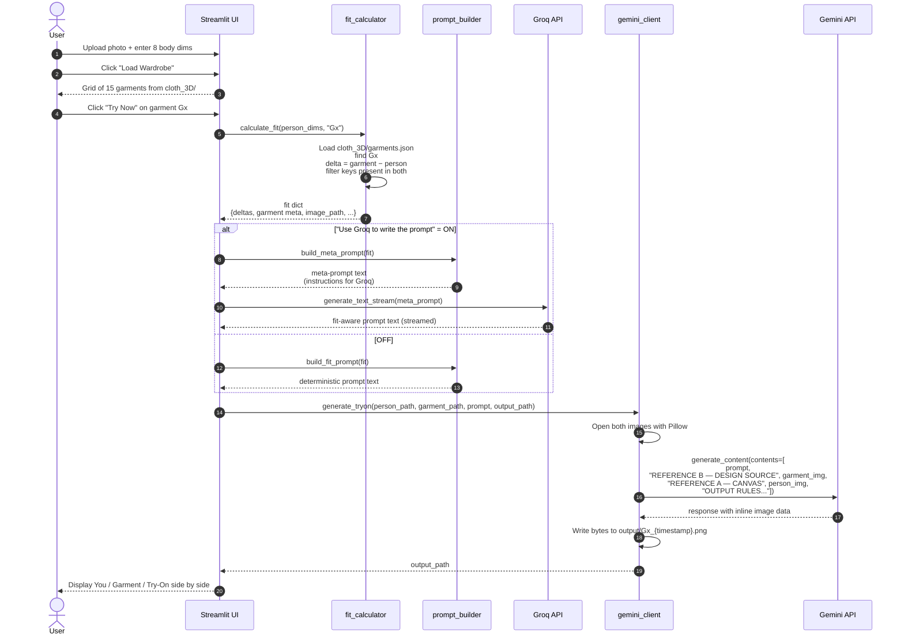

# Fit-Aware Virtual Try-On

A Streamlit app that renders photorealistic try-on images where the garment's **fit** physically reflects the difference between the user's body measurements and the garment's measurements. The generated image shows how a piece would actually sit on the wearer — tight, loose, cropped, draped — not just pasted on.

Image generation uses **Google Gemini 2.5 Flash Image** ("Nano Banana"). Fit-aware prompt writing uses **Groq** (Llama 3.3 70B) with a deterministic rule-based fallback. Garment references are **on-body photos** (a different model wearing the garment), so sleeve length / hem position / silhouette are communicated visually rather than from inch numbers that Gemini tends to misread.

---

## Table of contents

- [Key idea](#key-idea)
- [Architecture](#architecture)
- [Tech stack](#tech-stack)
- [Project structure](#project-structure)
- [End-to-end workflow](#end-to-end-workflow)
- [Setup](#setup)
- [Environment variables](#environment-variables)
- [Running locally](#running-locally)
- [Catalog schema](#catalog-schema)
- [Fit calculation](#fit-calculation)
- [Prompt pipeline](#prompt-pipeline)
- [Image generation pipeline](#image-generation-pipeline)
- [Identity lock strategy](#identity-lock-strategy)
- [Known limitations](#known-limitations)
- [Deployment to Streamlit Cloud](#deployment-to-streamlit-cloud)
- [Troubleshooting](#troubleshooting)

---

## Key idea

A traditional virtual try-on pastes a garment onto a person photo. It looks plausible but ignores fit — a size-S tee on a size-XL person still looks like a perfectly-fitted shirt.

This project adds a **fit-logic layer** on top of a generative image model:

1. User supplies body measurements (chest, shoulder, waist, hip, thigh, inseam, torso length).
2. Each garment in the catalog has measurements and an **on-body reference photo**.
3. The system computes per-landmark **deltas** = `garment − person` and converts them into physical fabric language (tension lines, drape, bunching, midriff exposure, etc.).
4. That language + the on-body reference + the user's photo is sent to Gemini, which renders the final image.

The on-body reference is the visual source of truth for the designed look (sleeve length, hem position, silhouette). The numeric deltas drive **circumference tightness** only. This split was introduced to stop Gemini from hallucinating the wrong sleeve length when it tried to reconcile text bands with a flat product photo.

---

## Architecture



---

## Tech stack

| Layer | Choice | Why |
|---|---|---|
| Frontend | Streamlit | Fast prototype UI, built-in file upload, session state. |
| Image model | Gemini 2.5 Flash Image (`gemini-2.5-flash-image`) | Multi-image conditioning; strongest at reference-based image editing. |
| Text model | Llama 3.3 70B on Groq (`llama-3.3-70b-versatile`) | Fast tokens/sec for the prompt-writing step. |
| Language | Python 3.11+ | SDKs available for both Gemini and Groq. |
| Image I/O | Pillow | Opens user uploads and garment references before passing to Gemini. |
| Env mgmt | python-dotenv | Local `.env`; Streamlit Cloud uses `st.secrets`. |

---

## Project structure

```
Fashion_Image/
├── app.py                      # Streamlit UI, session state, try-on orchestration
├── src/
│   ├── fit_calculator.py       # calculate_fit() — loads catalog, computes deltas
│   ├── prompt_builder.py       # build_meta_prompt() + build_fit_prompt() (rule-based)
│   ├── gemini_client.py        # generate_tryon() — multi-image edit call
│   └── groq_client.py          # generate_text() + generate_text_stream()
├── cloth_3D/
│   ├── garments.json           # Catalog (15 tops; on-body images)
│   └── *.jpg                   # Reference photos (model wearing garment)
├── cloth/                      # Legacy flat-lay set (not used by current app)
├── output/                     # Generated try-on PNGs (gitignored, ephemeral)
├── requirements.txt
├── .env                        # API keys (gitignored)
└── .gitignore
```

---

## End-to-end workflow

The full path of a single "Try Now" click:



### Step-by-step narrative

1. **User opens the app.** Sidebar prompts for a photo upload and 8 numeric measurements in inches (torso length, chest, shoulder, waist, hip, thigh, inseam, arm length).
2. **"Load Wardrobe" stores session state.** The uploaded image is saved to `output/_person_temp.png`; dimensions go into `st.session_state.person_dimensions`.
3. **Wardrobe grid renders** from [cloth_3D/garments.json](cloth_3D/garments.json) — 3 columns × 5 rows with each garment's reference photo, name, size, fit style, and per-landmark measurements.
4. **User clicks "Try Now"** on a garment. The garment ID is stored in session state and the page reruns.
5. **`calculate_fit()`** ([src/fit_calculator.py](src/fit_calculator.py)) loads the catalog, finds the garment, and returns a `fit` dict:
   ```
   { garment_id, garment_name, garment_size, garment_fit_style,
     garment_category, garment_type, image_path, units,
     person_dimensions, garment_dimensions,
     deltas: { chest: +2, shoulder: 0, length: -3, ... } }
   ```
6. **Prompt is built.** Two modes:
   - **Groq mode (default):** `build_meta_prompt(fit)` creates a long instruction for Groq describing the magnitude bands, the identity-lock rule, the untucked rule, etc. Groq writes the final fit-aware prompt in one pass.
   - **Rule-based mode:** `build_fit_prompt(fit)` deterministically assembles the prompt using per-dimension band lookups — no API call.
7. **Gemini is called.** [src/gemini_client.py](src/gemini_client.py) opens both images, then sends them to `generate_content` with **interleaved labeled text**. Image order: garment (REFERENCE B) first, person (REFERENCE A) last — the last image is treated by Gemini as the canvas.
8. **Response is parsed.** The first `inline_data` part in the response is written to `output/{garment_id}_{YYYYMMDD_HHMMSS}.png`.
9. **Result displayed** — user photo / garment reference / generated try-on in three columns, plus a Fit Analysis expander showing the delta dict and a Prompt expander with the exact text sent to Gemini.

---

## Setup

### Prerequisites
- Python 3.11+
- Gemini API key ([aistudio.google.com](https://aistudio.google.com))
- Groq API key ([console.groq.com](https://console.groq.com))

### Install

```bash
git clone <repo-url>
cd Fashion_Image
python -m venv venv
# Windows
venv\Scripts\activate
# macOS/Linux
source venv/bin/activate

pip install -r requirements.txt
```

### `requirements.txt`

```
streamlit>=1.36
google-genai>=0.3.0
Pillow>=10.0
python-dotenv>=1.0
pandas>=2.0
groq
```

---

## Environment variables

Create `.env` in the project root:

```env
GEMINI_API_KEY=your_gemini_key_here
GROQ_API_KEY=your_groq_key_here
```

The Gemini client ([src/gemini_client.py:20](src/gemini_client.py#L20)) accepts either `GEMINI_API_KEY` or the legacy lowercase `api_key`.

---

## Running locally

```bash
streamlit run app.py
```

Streamlit opens at `http://localhost:8501`. Keep the terminal running; hot-reload picks up source edits.

---

## Catalog schema

[cloth_3D/garments.json](cloth_3D/garments.json):

```json
{
  "units": "inches",
  "notes": "On-body / 3D reference set...",
  "garments": [
    {
      "id": "G1",
      "name": "Levi's White Batwing Logo Tee",
      "category": "Top",
      "type": "T-Shirt",
      "gender": "Women",
      "size": "S",
      "fit_style": "Slim",
      "image": "00000_00.jpg",
      "path": "00000_00.jpg",
      "dimensions": {
        "length": 25,
        "chest": 34,
        "shoulder": 14,
        "arm_length": 7
      }
    }
  ]
}
```

| Field | Purpose |
|---|---|
| `id` | Stable identifier used in session state and output filenames. |
| `name` | Display name in the wardrobe grid. |
| `category` | `"Top"` or `"Bottom"` — drives which body-zone dims matter. |
| `type` | Free-form (T-Shirt, Blouse, Henley, Shorts, etc.). |
| `size`, `fit_style` | Shown in the UI; passed to the prompt for context. |
| `path` | Relative to [cloth_3D/](cloth_3D/). Currently the same as `image`. |
| `dimensions` | Integer/float inches. Tops use `{length, chest, shoulder, arm_length}`; bottoms use `{waist, hip, thigh, inseam}`. Only keys that overlap with the user's dims produce deltas. |

The current set contains 15 women's tops. Bottoms can be added; the code paths handle both.

---

## Fit calculation

[src/fit_calculator.py](src/fit_calculator.py):

```python
def calculate_fit(person_dimensions: dict, cloth_id: str) -> dict:
    # loads catalog, finds garment by id
    deltas = {
        key: round(g_dims[key] - person_dimensions[key], 2)
        for key in g_dims
        if key in person_dimensions
    }
    return { ...garment meta..., "deltas": deltas }
```

**Delta convention:**
- `delta = garment_value − person_value`
- **Negative delta** → garment smaller than person at this landmark → tight / compressed / short / exposed.
- **Positive delta** → garment larger than person → relaxed / draped / long / bunched.

Only keys present in **both** the garment's dims and the person's dims produce deltas. A top's `arm_length` won't produce a delta if the user is providing only upper-body measurements; a bottom's `inseam` won't produce one if the person entered only tops-relevant dims.

---

## Prompt pipeline

### Meta-prompt → Groq → final prompt

`build_meta_prompt(fit)` in [src/prompt_builder.py](src/prompt_builder.py) builds an ~800-line system prompt that tells Groq exactly how to write the final image-generation prompt. Key sections:

- **Rule 0: IDENTITY LOCK** — the output person must be REFERENCE A; REFERENCE B's face/hair/body must not appear.
- **Inputs block** — garment name, category, size, fit style, and the full dimension comparison table.
- **Magnitude calibration** — bands for CHEST, SHOULDER, LENGTH, WAIST, HIP, THIGH, INSEAM with exact physical language for each delta range. (The ARM/SLEEVE band is deliberately absent — sleeve length is pinned to REFERENCE B visually.)
- **Intent modulation** — how to interpret bands in light of the intended fit style (Bodycon, Relaxed, Oversized, etc.) and garment type.
- **7-point output spec** — the final prompt must open with IDENTITY LOCK, declare what to TAKE from A vs B, state the untucked rule, cover each delta band, synthesize overall silhouette, and close with rendering instructions.

Groq is called at `temperature=0.7` by default; lowering to 0.1 makes run-to-run prompts more stable at the cost of variety.

### Deterministic fallback

`build_fit_prompt(fit)` skips Groq entirely and assembles the prompt from string templates. Each landmark runs through a `_describe(dim, delta, ...)` function with hard-coded bands. Slightly less natural language, fully reproducible, no API cost.

---

## Image generation pipeline

[src/gemini_client.py](src/gemini_client.py):

```python
contents = [
    prompt,                                     # fit-aware text prompt
    "REFERENCE B — GARMENT DESIGN SOURCE...",   # label
    garment_img,                                # on-body reference (PIL Image)
    "REFERENCE A — THE CANVAS...",              # label
    person_img,                                 # user photo (PIL Image)
    "OUTPUT RULES: ...",                        # final identity reminder
]
response = client.models.generate_content(model="gemini-2.5-flash-image", contents=contents)
```

### Why this ordering

- **Garment first, person last.** Gemini 2.5 Flash Image tends to treat the *last* image in a multi-image prompt as the primary scene / canvas. Putting the person last nudges the model to preserve her face, pose, and background.
- **Each image has a labeled text immediately before it.** Helps Gemini associate the right role with each image when the two photos look visually similar (both women on neutral backgrounds).
- **Final reminder at the end.** Repetition at the end of the content list tends to be weighted heavily — the OUTPUT RULES block restates "output face must match REFERENCE A" one more time.

### Response handling

```python
for part in response.candidates[0].content.parts:
    if getattr(part, "inline_data", None) is not None:
        Path(output_path).write_bytes(part.inline_data.data)
        return output_path
```

Errors are surfaced for:
- No candidates returned (safety block / content policy).
- Candidate with no parts (filter hit).
- Candidate with text but no image (model refused or asked a clarifying question).

---

## Identity lock strategy

The single biggest failure mode when using on-body references is Gemini generating the *reference model's* face/hair instead of the user's. The fix is defense-in-depth — the identity-preservation instruction appears **three times**:

1. In the **meta-prompt** (Rule #0) — tells Groq that the first thing in its output must be an IDENTITY LOCK paragraph.
2. In Groq's **output prompt** — the first paragraph Gemini reads.
3. In the **Gemini `contents` list** — the final OUTPUT RULES block after both images.

Plus the structural nudge of putting the person image last in the list.

---

## Known limitations

| Limitation | Mitigation |
|---|---|
| Gemini doesn't reliably map inches to pixels — a Δ=−8 won't render as exactly 8" tighter. | Magnitude bands describe the *physical effect*, not the number. Deltas drive direction, not precision. |
| Gemini can still drift on untouched regions (hem, collar) across runs with the same input. | Temperature of the Groq prompt writer can be lowered. Gemini itself has no seed. |
| The catalog's `dimensions` are visual estimates, not real product spec sheets. | Re-measure if you need accuracy. `notes` in `garments.json` calls this out. |
| `arm_length` comparison can be semantically off — user's shoulder-to-wrist ≠ garment's sleeve length. | With on-body references, sleeve length is enforced visually. The arm_length band is intentionally omitted from the meta-prompt. |
| `output/` is ephemeral on Streamlit Cloud containers. | Push to S3 / GCS if you need a persistent gallery. |
| Run-to-run variation in Gemini output. | Expected — image generation is inherently stochastic without a seed. |

---

## Deployment to Streamlit Cloud

1. **Push to GitHub.** `.gitignore` already excludes `.env`, `venv/`, `output/`, and `.streamlit/secrets.toml`.
2. **share.streamlit.io → New app.** Pick repo + branch, main file = `app.py`.
3. **Advanced settings → Secrets** (TOML):
   ```toml
   GEMINI_API_KEY = "your-gemini-key"
   GROQ_API_KEY   = "your-groq-key"
   ```
4. Bridge `st.secrets` → `os.environ` at the top of `app.py` so the existing client code (which reads env vars) works unchanged:
   ```python
   try:
       for k in ("GEMINI_API_KEY", "api_key", "GROQ_API_KEY"):
           if k in st.secrets and not os.environ.get(k):
               os.environ[k] = st.secrets[k]
   except Exception:
       pass  # local .env handles it
   ```
5. **Deploy.** First build ~3–5 min.

Free tier: 1 GB RAM / 1 CPU — sufficient since all heavy compute is offloaded to the two APIs.

---

## Troubleshooting

| Symptom | Likely cause | Fix |
|---|---|---|
| `Gemini returned no candidates — block_reason=...` | Safety filter triggered by extreme delta language. | Try a less extreme garment/person combination; lower delta magnitudes. |
| `Gemini response contained no image data` | Model refused or only returned text. | Re-run; check the `finish_reason` in the error message. |
| Output face is the garment model's, not the user's | Identity lock not sufficient. | Verify both images differ visibly; confirm `contents` ordering in `gemini_client.py`. |
| Sleeves in output differ from the reference | Gemini applied aesthetic priors (oversized tee → short sleeves). | The "do not lengthen/shorten sleeves" rule is already in the prompt; repeat it if this recurs. |
| `No API key found` at startup | Missing `.env` or Streamlit secrets. | Add `GEMINI_API_KEY` and `GROQ_API_KEY`. |
| Wardrobe grid empty | Bad catalog path. | Confirm `CLOTH_DIR = PROJECT_ROOT / "cloth_3D"` in [app.py:33](app.py#L33) and `CATALOG_PATH` in [src/fit_calculator.py:11](src/fit_calculator.py#L11) match. |
| Streamlit hot-reload not picking up changes | Cached `load_catalog()`. | Click "Rerun" in the top-right or restart the server. |

---

## Contributing / extending

- **Add a garment** — drop a new on-body `.jpg` in [cloth_3D/](cloth_3D/), add a corresponding entry in [cloth_3D/garments.json](cloth_3D/garments.json). `id` must be unique.
- **Tune a fit band** — edit the relevant section in [src/prompt_builder.py](src/prompt_builder.py) (for Groq mode, edit `build_meta_prompt`; for rule-based mode, edit the `_describe` branch for that dimension).
- **Switch image model** — change `MODEL_NAME` in [src/gemini_client.py:16](src/gemini_client.py#L16).
- **Switch text model** — change `TEXT_MODEL_NAME` in [src/groq_client.py:19](src/groq_client.py#L19).
